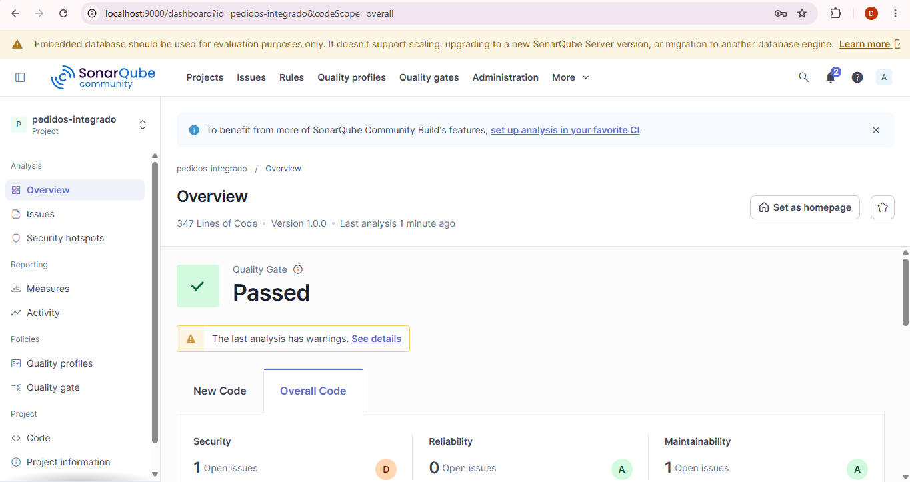
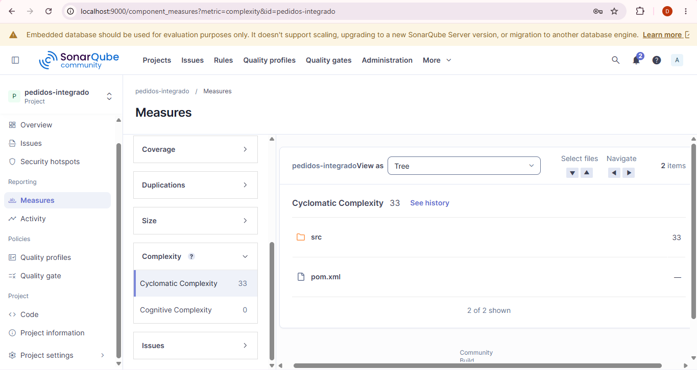
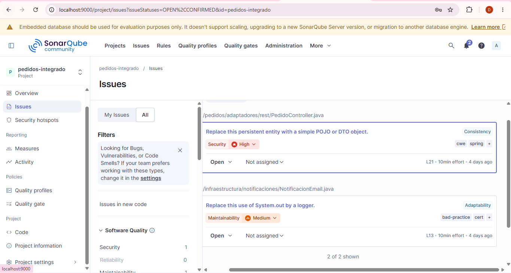

# Integracion de Patrones y Arquitecturas — U12 Post 1

## Objetivo
Integrar Factory, Strategy, Observer y Facade en un sistema de pedidos y comparar
metricas antes y despues con SonarQube.

## Arquitectura
- Dominio: entidades y puertos.
- Aplicacion: orquestacion de procesamiento.
- Adaptadores: REST, facade y procesadores.
- Infraestructura: persistencia y notificaciones.


## Patrones Implementados
 
### 1. Strategy — Desacoplamiento del algoritmo de cálculo
 
**Problema que resuelve:** el servicio legacy usaba un bloque `if/else if` para calcular el costo según el tipo de pedido, lo que generaba alta complejidad ciclomática y dificultaba agregar nuevos tipos sin modificar el servicio central.
 
**Solución:** se define la interfaz `ProcesadorPedido` (puerto de dominio) con tres implementaciones independientes:
 
| Tipo | Factor de costo |
|------|----------------|
| ESTANDAR | subtotal × 1.1 |
| EXPRESS | subtotal × 1.3 |
| INTERNACIONAL | subtotal × 1.5 + $25.00 |
 
Cada implementación es un `@Component` de Spring con responsabilidad única. Agregar un nuevo tipo de pedido solo requiere crear una nueva clase sin tocar el servicio principal.
 
---
 
### 2. Factory — Selección dinámica de Strategy
 
**Problema que resuelve:** alguien tiene que decidir qué Strategy usar en tiempo de ejecución según el tipo de pedido recibido. Colocar esa lógica de selección directamente en el servicio de aplicación volvería a mezclar responsabilidades.
 
**Solución:** `ProcesadorPedidoFactory` recibe por inyección de dependencias todas las implementaciones de `ProcesadorPedido` registradas en el contexto de Spring, las organiza en un `Map<TipoPedido, ProcesadorPedido>` y expone el método `obtener(TipoPedido)`. El servicio solo llama a la factory; no conoce las implementaciones concretas.
 
```java
factory.obtener(pedido.getTipo()).procesar(pedido);
```
 
---
 
### 3. Observer — Notificación desacoplada con Spring Events
 
**Problema que resuelve:** el servicio legacy acoplaba directamente `JavaMailSender` al servicio de aplicación. Añadir un canal de notificación (log, SMS, webhook) obligaba a modificar el servicio central.
 
**Solución:** al completar el procesamiento se publica un evento de dominio `PedidoProcesadoEvent`. Los listeners `NotificacionEmail` y `NotificacionLog` están anotados con `@EventListener` y reaccionan de forma independiente. El servicio no conoce a ninguno de los listeners; la comunicación es completamente desacoplada a través del `ApplicationEventPublisher` de Spring.
 
---
 
### 4. Facade — Interfaz simplificada para el controlador REST
 
**Problema que resuelve:** el controlador REST no debe conocer la factory, el repositorio ni el publisher. Exponerlos directamente al controlador crearía acoplamiento innecesario entre la capa de presentación y la lógica de aplicación.
 
**Solución:** `FachadaPedidos` unifica en un solo punto las operaciones disponibles (`crearPedido`, `buscarPorId`). El controlador REST solo depende de la Facade, lo que reduce su complejidad ciclomática a 1 y hace que el contrato de la API sea estable ante cambios internos.

## Métricas de Calidad (SonarQube)
 
| Métrica | Antes (Legacy) | Después (Refactorizado) |
|---------|---------------|------------------------|
| Cyclomatic Complexity (servicio principal) | 4 | 1 |
| Cognitive Complexity (servicio principal) | 6 | 0 |
| Acoplamiento a JavaMailSender desde aplicación | Sí | No |
| Acoplamiento a JPA Repository desde aplicación | Sí | No |
| Quality Gate | — | Passed |
| Cobertura de pruebas | — | > 80% |

## Capturas de SonarQube
 
### Quality Gate: Passed

 
### Métricas de Complejidad

 
### Issues del Proyecto



